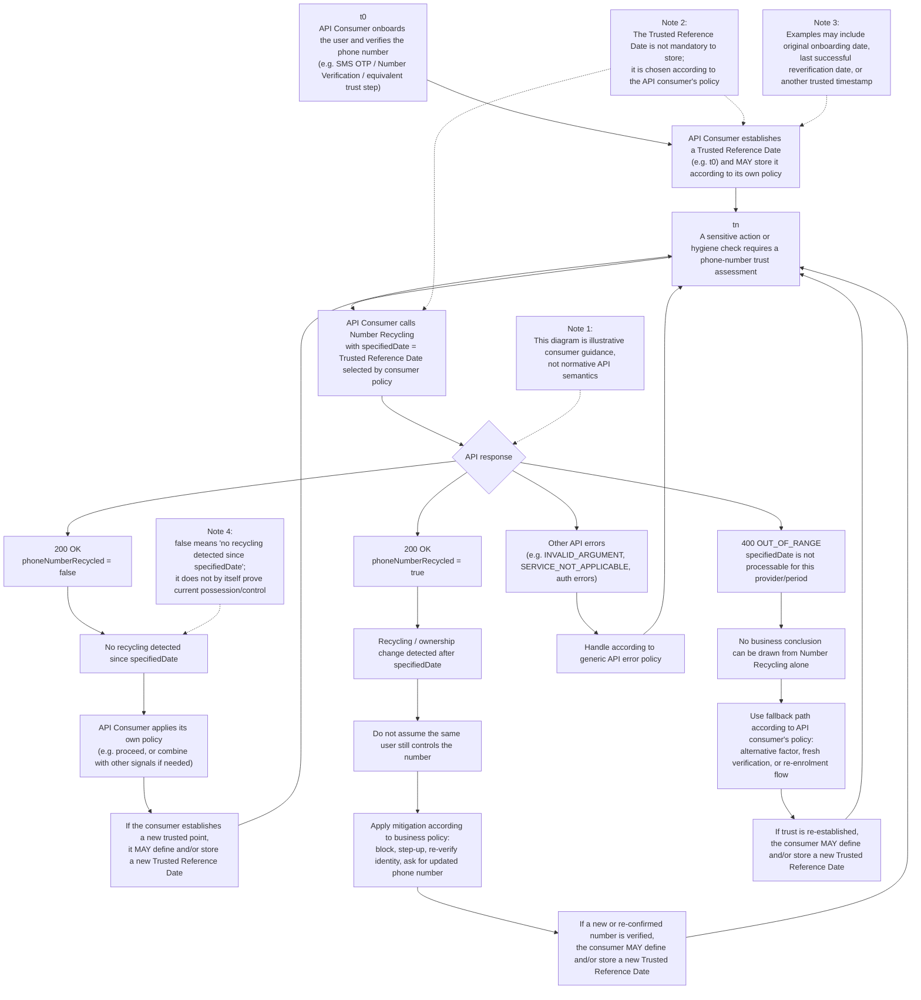

# How to Use the Number Recycling API

## Introduction

This supporting document presents the flow diagram on how to use the Number Recycling API from API consumers perspective.

## Flow Diagram

```mermaid
    flowchart TD
        A["t0<br/>API Consumer onboards the user and verifies the phone number<br/>(e.g. SMS OTP / Number Verification / equivalent trust step)"]
        A2["API Consumer establishes a Trusted Reference Date<br/>(e.g. t0) and MAY store it according to its own policy"]

        B["tn<br/>A sensitive action or hygiene check requires a phone-number trust assessment"]
        C["API Consumer calls Number Recycling<br/>with specifiedDate = Trusted Reference Date selected by consumer policy"]

        D{"API response"}

        E["200 OK<br/>phoneNumberRecycled = false"]
        F["200 OK<br/>phoneNumberRecycled = true"]
        G["400 OUT_OF_RANGE<br/>specifiedDate is not processable for this provider/period"]
        H["Other API errors<br/>(e.g. INVALID_ARGUMENT, SERVICE_NOT_APPLICABLE, auth errors)"]

        E1["No recycling detected since specifiedDate"]
        E2["API Consumer applies its own policy<br/>(e.g. proceed, or combine with other signals if needed)"]
        E3["If the consumer establishes a new trusted point,<br/>it MAY define and/or store a new Trusted Reference Date"]

        F1["Recycling / ownership change detected after specifiedDate"]
        F2["Do not assume the same user still controls the number"]
        F3["Apply mitigation according to business policy:<br/>block, step-up, re-verify identity, ask for updated phone number"]
        F4["If a new or re-confirmed number is verified,<br/>the consumer MAY define and/or store a new Trusted Reference Date"]

        G1["No business conclusion can be drawn from Number Recycling alone"]
        G2["Use fallback path according to API consumer's policy:<br/>alternative factor, fresh verification, or re-enrolment flow"]
        G3["If trust is re-established,<br/>the consumer MAY define and/or store a new Trusted Reference Date"]

        H1["Handle according to generic API error policy"]

        Z1["Note 1:<br/>This diagram is illustrative consumer guidance,<br/>not normative API semantics"]
        Z2["Note 2:<br/>The Trusted Reference Date is not mandatory to store;<br/>it is chosen according to the API consumer's policy"]
        Z3["Note 3:<br/>Examples may include original onboarding date,<br/>last successful reverification date, or another trusted timestamp"]
        Z4["Note 4:<br/>false means 'no recycling detected since specifiedDate';<br/>it does not by itself prove current possession/control"]

        A --> A2 --> B --> C --> D
        D --> E --> E1 --> E2 --> E3 --> B
        D --> F --> F1 --> F2 --> F3 --> F4 --> B
        D --> G --> G1 --> G2 --> G3 --> B
        D --> H --> H1 --> B
        
        Z1 -.-> D
        Z2 -.-> A2
        Z2 -.-> C
        Z3 -.-> A2
        Z4 -.-> E1
``` 